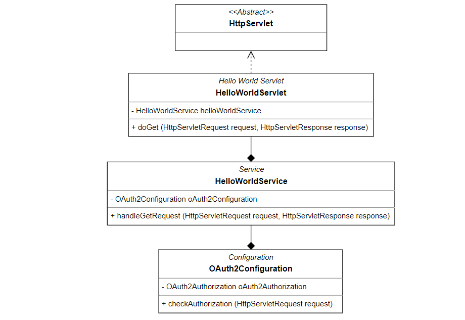

# HelloWorldServletOAuth2

**SAP JAVA sdk should be configured. See more in [SAP Development Tools](https://tools.hana.ondemand.com/#cloud)**

---

Servlet deployed in SCP and authenticad through oAuth2

- Unit tests (Authorized, Not Authorized, Failed)
- Code coverage above 90%

## UML Diagram

